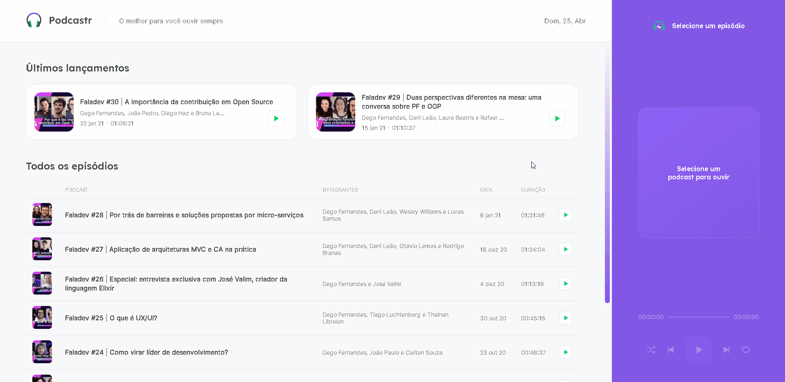

<h1 align="center">
  
</h1>

## **<h2 align="center">[Front end application](https://podcastr-mathwcruz.vercel.app/)  💻</h2>**

## 
<h2 align="center">A Podcast app developed in #NLW05 delivered by [Rocketseat](https://app.rocketseat.com.br/dashboard)</h2> 

  <a href="#computer-demonstration-of-the-application">Demonstration of the application</a>&nbsp;&nbsp;&nbsp;|&nbsp;&nbsp;&nbsp;
  <a href="#star-features">Features</a>&nbsp;&nbsp;&nbsp;|&nbsp;&nbsp;&nbsp;
  <a href="#rocket-technologies-used">Technologies used</a>&nbsp;&nbsp;&nbsp;|&nbsp;&nbsp;&nbsp;
  <a href="#information_source-application-installation">Application installation</a>

# :computer: Demonstration of the application

  

 

<h3 align="center"> 
	Application status: Finalized ✔️
</h3>
 

## :star: Features
- [x] List podcast episodes 
- [x] Details of a specific episode
- [x] Listen to an episode
- [x] Listen to the episode before the current
- [x] Listen to the next episode to the current
- [x] Pause an episode
- [x] Shuffle the list of episodes
- [x] Repeat an episode

## :rocket: Technologies used:

 

## :information_source: Application installation
- `git clone https://github.com/mathwcruz/podcastr_nlw05.git` to clone the repository

 

# 🎲 Run application
To run the application on the web, follow the instructions from your terminal:
- `cd podcastr_nlw05` and `code .`
- run `yarn` to install the dependencies of the project
- After that, run `yarn dev` to run the application, will open at the address `localhost:3000`
 

### Author
---

<a href="https://app.rocketseat.com.br/me/matheus-da-cruz-frontend">
 
  
 <b>Matheus da Cruz</b></a> <a href="https://app.rocketseat.com.br/me/matheus-da-cruz-frontend" title="Rocketseat">  🚀</a>

Desenvolvido por Matheus da Cruz 😊

 

 

## **
Thank you very much to the people of Rocketseat 🚀 for the excellent content and didactics, it is clear the impact of this company in my studies 🙂
**
